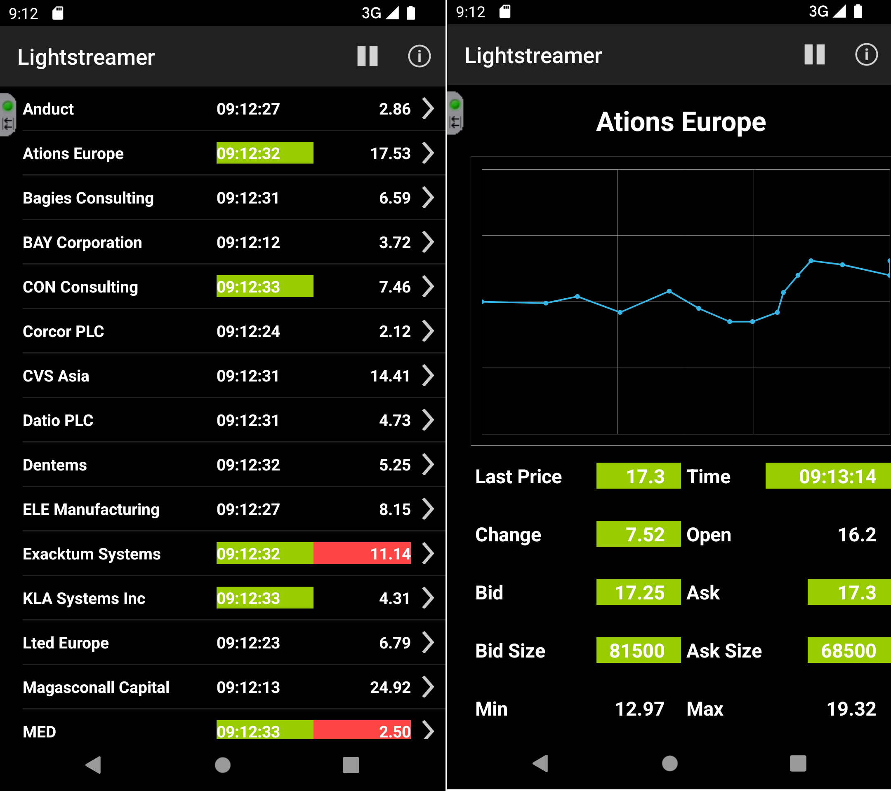

# Lightstreamer - Stock-List Demo - Android Client


This project contains a full example of an Android application that employs the [Lightstreamer Android Client library](http://docs.lightstreamer.com/api/ls-android-client-compact/latest/)
to subscribe to real-time updates.

An extended version, including support for GCM push notifications is also available: [Stock-List Demo with GCM Push Notifications - Android Client](https://github.com/Lightstreamer/Lightstreamer-example-MPNStockList-client-android)


## Live Demo

[](https://play.google.com/store/apps/details?id=com.lightstreamer.simple_demo.android)
 
[](https://play.google.com/store/apps/details?id=com.lightstreamer.simple_demo.android)


###[ View live demo](https://play.google.com/store/apps/details?id=com.lightstreamer.simple_demo.android)
(To install the app from the Google Play Store, you can also use the above QR code)


## Details

This is a Java-for-Android version of the [Lightstreamer - Basic Stock-List Demo - HTML client](https://github.com/Lightstreamer/Lightstreamer-example-StockList-client-javascript#basic-stock-list-demo---html-client).<br>
This app uses the <b>Android Client API for Lightstreamer</b> to handle the communications with Lightstreamer Server. A simple user interface is implemented to display the real-time data received from Lightstreamer Server.<br>

Touch a row opens a new panel with the detailed information, updated in real-time, of the stock.

### Dig the Code

* `StockListDemoApplication.java` is the class representing the application itself. It creates and manage the LightstreamerClient instance
that is shared by the other classes. A proxy to such instance is exposed as a singleton to the entire application.
* `StockListDemo.java` is the entry point and only `Activity` of the application. It contains two `Fragment`s, the manu bar for
the app and listens to LightstreamerClient status events to show the connection status to the user. The two `Fragment` are both visible 
if the application runs on tablet; on the contrary, only one `Fragment` is visible and are exchanged based on the user interaction
* `SubscriptionFragment.java` represents a `Fragment` containing a subscription that is started/stopped based on the lifecycle of 
the `Fragment`. Please note that this class does not actually extend `Fragment`.
* `StocksFragment.java` and `DetailsFragment.java` are the classes representing the two fragments of the application. 
* `Chart.java` wraps the AndroidPlot APIs to plot the real-time chart on the details fragment.


Check out the sources for further explanations.
  
*NOTE: Not all the functionalities of the Lightstreamer Android Java client are exposed by the classes listed above. You can easily expand those functionalities using the [Android Client API](http://www.lightstreamer.com/docs/client_android_uni_api/index.html) as a reference. If in trouble check out the [specific Lightstreamer forum](http://forums.lightstreamer.com/forumdisplay.php?33-Android-Client-API).*

## Install

If you want to install a version of this demo pointing to your local Lightstreamer Server and running into 
an [Android Virtual Device](http://developer.android.com/tools/devices/emulator.html), follow these steps:

* Note that, as prerequisite, the [Lightstreamer - Stock-List Demo - Java Adapter](https://github.com/Lightstreamer/Lightstreamer-example-Stocklist-adapter-java) 
has to be deployed on your local Lightstreamer Server instance. Please check out that project and follow the installation 
instructions provided with it. 
* Launch Lightstreamer Server.
* Download the `deploy.zip` file, which you can find in the [deploy release](https://github.com/Lightstreamer/Lightstreamer-example-AdvStockList-client-android/releases) 
of this project and extract the `Android_StockListDemo.apk` file.
* Locate or install the [Android SDK](http://developer.android.com/sdk/index.html)
* Install the `Android_StockListDemo.apk` in your emulator:
  * Execute the emulator (Android SDK/SDK Manager->Tools->Manage AVDs...->New then Start)
  * Open the console and move to the platform-tools folder of SDK directory.
  * Then type the following command:
    ```
    adb install [.apk path]
    ```
* Look up the demo in your virtual device and launch it.

*Note that the demo targets the Lightstreamer server @ http://10.0.2.2:8080 because 10.0.2.2 is the special alias to your host loopback interface.*

## Build

### Setup the IDE

Note that you can skip this section and build the application without using any IDE. 

You can either open the provided project into [Android Studio](https://developer.android.com/sdk/installing/studio.html) or
you can import the sources, the resources, the AndroidManifest file and the required 
dependencies into new [Eclipse](http://www.eclipse.org/) project (provided you installed the necessary [ADT plugin](http://developer.android.com/sdk/eclipse-adt.html)).

In the Eclipse case, you'll need to separately download the [Android SDK](http://developer.android.com/sdk/), configure the project to
use the [v7 Support Library](https://developer.android.com/tools/support-library/setup.html) and discover the required libraries and 
their dependencies by looking at the provided gradle build files.

### Deploy
  
You may run the demo against your local server or using our online server at http://push.lightstreamer.com:80. The server to which the demo will connect to is configured in the `app/src/main/res/values/strings.xml` file.
In the former case, the example requires that the [QUOTE_ADAPTER](https://github.com/Lightstreamer/Lightstreamer-example-Stocklist-adapter-java) has to be deployed in your local Lightstreamer server instance;
the [LiteralBasedProvider](https://github.com/Lightstreamer/Lightstreamer-example-ReusableMetadata-adapter-java) is also needed, but it is already provided by Lightstreamer server.

### Build

To build your own version of the demo you can launch the provided gradle script from the command line or from the IDE itself.
As an example you can build and install a debug version of the application in an emulator (or device) by running
```
gradlew installDebug
```

You might also use a different build tool (e.g.: Maven, Ivy, etc.) by converting the provided gradle build files. 

## See Also

### Lightstreamer Adapters Needed by This Demo Client

* [Lightstreamer - Stock-List Demo - Java Adapter](https://github.com/Lightstreamer/Lightstreamer-example-Stocklist-adapter-java)
* [Lightstreamer - Reusable Metadata Adapters - Java Adapter](https://github.com/Lightstreamer/Lightstreamer-example-ReusableMetadata-adapter-java)

### Related Projects

* [Lightstreamer - Stock-List Demos - HTML Clients](https://github.com/Lightstreamer/Lightstreamer-example-Stocklist-client-javascript)
* [Lightstreamer - Stock-List Demo with GCM Push Notifications - Android Client](https://github.com/Lightstreamer/Lightstreamer-example-MPNStockList-client-android)

## Lightstreamer Compatibility Notes

* Compatible with Lightstreamer Android Client API v. 2.0 or newer.
* For Lightstreamer Allegro (+ Android Client API support), Presto, Vivace.
* For a version of this example compatible with Lightstreamer Android Client API version 1.1, please refer to [this tag](https://github.com/Lightstreamer/Lightstreamer-example-AdvStockList-client-android/tree/latest-for-client-1.x).

